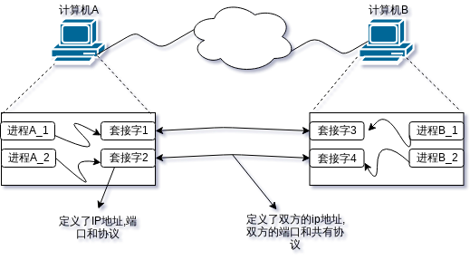
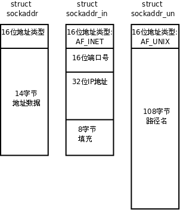

# Linux下网络 Socket 编程预备知识

> Linux系统的一大特点是它的网络编程能力十分强大, 学习它, 让我们真正体会网络的魅力!

## 一. 客户机/服务器模型

网络应用程序一般是以c/s模型的方式工作的,因特网便是c/s模型的一个典型例子,
在这种工作方式中,一个服务器通常事先启动,并在一个熟知端口帧听对服务器的请求,
如ftp服务器,web服务器等.当客户机应用程序需要某种服务时,需向提供这个服务的
服务器发出请求,服务器收到请求后,向客户机发出相应请求服务.这样客户机应用程序
和服务器程序之间就建立了通信连接,此后便可以进行数据通信,通信任务完成后,需要
关闭它们之间的通信连接.

## 二. Socket套接字概念

在网路中要全局的标示一个参与通信的进程,需要采用三元组:　协议，　主机ip地址,
端口号.要描述两个应用进程之间的端到端的通信则需要一个五元组: 协议,信源机ip
地址,信源应用进程端口, 信宿机ip地址,信宿应用进程端口.那么从程序设计的角度如
何实现两个应用进程的通信连接的建立,并如何实现两个进程指佳酿数据传输呢?
    人们引入套接字(Socket)的概念.

   - 套接字实现了对网络和传输层协议的封装
   - 套接字可以看做是处于不同主机之间的两个进程的通信连接端点
   - 在实现两个进程间的通信时, 首先应用进程各自创建自己的套接字,然后通过套接字建立双方的通信链路,进而利用各自的套接字进行数据的发送个接收

socket这个词可以表示很多概念：

+ 在TCP/IP协议中，“IP地址+TCP或UDP端口号”唯一标识网络通讯中的一个进程，“IP地址+端口号”就称为socket。

+ 在TCP协议中，建立连接的两个进程各自有一个socket来标识，那么这两个socket组成的socket pair就唯一标识一个连接。socket本身有“插座”的意思，因此用来描述网络连接的一对一关系。

+ TCP/IP协议最早在BSD UNIX上实现，为TCP/IP协议设计的应用层编程接口称为socket API

## 三. 套接字编程基础

> Tcp/Ip的核心内容被封装在操作系统中,网络应用程序要使用tcp/ip来实现自己的功能,需要通过操作系统提供给用户的编程借口来实现. 套接字就是Tcp/Ip网络编程接口的集合,他是应用程序预tcp/ip协议族通信的中间软件抽象层.

### 1. socket

    int socket(int domain, int type,int protocol)

domain:说明我们网络程序所在的主机采用的通讯协族(AF_UNIX 和 AF_INET 等). AF_UN
IX 只能够用于单一的 Unix 系统进程间通信,而 AF_INET 是针对 Internet 的,因而可以允许在
远程 主机之间通信(当我们 man socket 时发现 domain 可选项是 PF_*而不是 AF_*,因为
glibc 是 posix 的实现 所以用 PF 代替了 AF,不过我们都可以使用的).

type:我们网络程序所采用的通讯协议(SOCK_STREAM,SOCK_DGRAM 等) 

SOCK_STREAM 表明我们用的是 TCP 协议,这样会提供按顺序的,可靠,双向,面向连接的比特流. 

SOCK_DGRAM表明我们用的是 UDP 协议,这样只会提供定长的,不可靠,无连接的通信.

protocol:由于我们指定了 type,所以这个地方我们一般只要用 0 来代替就可以了 socket 为网络通讯做基本的准备.成功时返回文件描述符,失败时返回-1,看 errno 可知道出错的详细情况.

### 2. bind
    int bind(int sockfd, struct sockaddr *my_addr, int addrlen)

sockfd:是由 socket 调用返回的文件描述符.

addrlen:是 sockaddr 结构的长度.

my_addr:是一个指向 sockaddr 的指针. 在<linux/socket.h>中有 sockaddr 的定义

    struct sockaddr{
        unisgned short as_family;
        char sa_data[14];
    };
不过由于系统的兼容性,我们一般不用这个头文件,而使用另外一个结构(struct sockaddr_in) 来代替.在<linux/in.h>中有 sockaddr_in 的定义

    struct sockaddr_in{
        unsigned short sin_family;
        unsigned short int sin_port;
        struct in_addr sin_addr;
        unsigned char sin_zero[8];
    }
    注: 由于sockaddr数据结构与sockaddr_in数据结构的大小是相同的,指向sockaddr_in的指针可以通过强制类型转换,转换成指向sockaddr结构的指针

我们主要使用 Internet 所以 sin_family 一般为 AF_INET,

sin_addr 设置为 INADDR_ANY 表示可以 和任何的主机通信,

sin_port 是我们要监听的端口号.

sin_zero[8]是用来填充的

bind 将本地的端口同 socket 返回的文件描述符捆绑在一起.成功是返回 0,失败的情况和socket 一样

### 3. listen

    int listen(int sockfd,int backlog)
sockfd:是 bind 后的文件描述符.

backlog:设置请求排队的最大长度.当有多个客户端程序和服务端相连时, 使用这个表示可以介绍的排队长度. 

listen 函数将 bind 的文件描述符变为监听套接字.返回的情况和 bind 一样.

### 4. accept

    int accept(int sockfd, struct sockaddr *addr,int *addrlen)

sockfd:是 listen 后的文件描述符.

addr,addrlen 是用来给客户端的程序填写的,服务器端只要传递指针就可以了. bind,listen 和 accept 是服务器端用的函数,accept 调用时,服务器端的程序会一直阻塞到有一个客户程序发出了连接. accept 成功时返回最后的服务器端的文件描述符,这个时候服务器端可以向该描述符写信息了. 失败时返回-1

### 5. connect

    int connect(int sockfd, struct sockaddr * serv_addr,int addrlen)

sockfd:socket 返回的文件描述符.

serv_addr:储存了服务器端的连接信息.其中 sin_add 是服务端的地址

addrlen:serv_addr 的长度

connect 函数是客户端用来同服务端连接的.成功时返回 0,sockfd 是同服务端通讯的文件描述符 失败时返回-1.

### 6. 网络字节顺序

    内存中的多字节数据相对于内存地址有大端和小端之分，磁盘文件中的多字节数据相对于文件中的偏移地址也
    有大端小端之分。网络数据流同样有大端小端之分，那么如何定义网络数据流的地址呢？发送主机通常将发送
    缓冲区中的数据按内存地址从低到高的顺序发出，接收主机把从网络上接到的字节依次保存在接收缓冲区中，
    也是按内存地址从低到高的顺序保存，因此，网络数据流的地址应这样规定：先发出的数据是低地址，后发出
    的数据是高地址。

Tcp/Ip协议规定, 网络传输字节顺序为高位优先,为了使网络程序具有可移植性,可以调用库函数做网络字节序和主机字节序的转换

    #include<arpa/inet.h>

    uint32_t htonl(uint32_l hostlong);
    uint16_t htons(uint16_t hostshort);
    uint32_t ntohl(uint32_t netlong);
    uint16_t ntohs(uint16_t netshort);