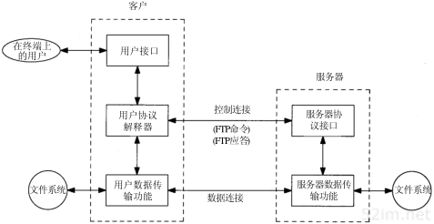

# Linux网络编程篇之FTP协议详解及Socket实现FTP程序

# 一. FTP协议详解

## 1. 协议背景,功能概述

计算机网络的基本功能之一就是资源共享. 大多数联网计算机系统都支持网络文件访问功能,即可以进行n远程文件的访问和文件传输.
文件传输协议(File Transfer Protocol, FTP)的主要作用就是让用户连接到远程计算机进行文件查看,把文件从远程计算机上拷到本地计算机,或把本地计算机文件传到远程计算机.
FTP属于TCP/IP协议族的应用层协议, 其传输层使用的是TCP, 基于C/S模式工作, 为数据传输提供了可靠的保证. FTP支持多种文件类型和文件格式.如文本类型和二进制文件等.                 

## 2. FTP工作原理

FTP使用客户机/服务器模式. FTP的工作过程其实就是客户机程序根据用户需求发送命令, 服务器程序响应命令的过程. 在FTP工作过程需要建立两种类型的连接:  `控制连接` 和     `数据连接` . 控制连接接收客户机程序发出的命令和服务器返回相应信息, 而数据传输则负责传输文件的内容.

一般来说，客户端有一个 Socket(对应控制连接) 用来连接 FTP 服务器的相关端口，它负责 FTP 命令的发送和接收返回的响应信息。一些操作如“登录”、“改变目录”、“删除文件”，依靠这个连接发送命令就可完成

对于有数据传输的操作，主要是显示目录列表，上传、下载文件，我们需要依靠另一个 Socket(对应数据连接)来完成.

FTP工作示意图如下.

## 3. 工作步骤详解

FTP的工作过程主要包括以下几个步骤:
1. **启动FTP服务器**
    用于FTP采用了客户机/服务器工作模式, 因此在创建FTP会话之前, 首先必须启动FTP服务器, 并使其处于客户机程序的FTP请求状态.

2. **打开FTP并建立控制连接**
    启动FTP客户机, 并向FTP服务器的21端口(控制连接端口)发出主动连接的请求, 以期获得FTP服务器的相应权限. 服务器相应请求后便在用户协议解释器和服务器协议解释器之间建立一条TCP连接. 这样用户FTP命令和服务器的应答信号都将在该连接上传输. 因此称之为控制连接.
3. **建立数据连接并进行文件传输**
    用户通过客户机程序输入FTP命令, 服务器接收命令. 如果命令正确且需要进行文件传输,服务器使用TCP20 端口在双方之间建立另一条TCP连接, 即数据连接., 并通过该连接进行文件传输. 当本次命令的文件传输完毕, 关闭该数据连接. 数据连接的建立与控制连接不同, 它是由服务器主动提出. 因此客户机程序需要事先创建一个套接字, 并将该套接字地址和临时分配的端口号通过控制连接发送给服务器.
4. **关闭套接字**
    用户执行完其所需的FTP命令后, 发送退出FTP命令, 控制连接关闭, 本次FTP服务结束. 

## 4. FTP主要命令和应答

FTP是TCP/IP协议族的应用层协议, 其功能的实现主要依赖与命令和应答信息. FTP的命令和应答信息都在控制连接上传输. 由用户协议解释器负责发送命令和解释收到的应答信息, 由服务器协议解释器执行命令并把执行情况以应答信息的形式发给客户端. 每个命令以<CR/LF>对结尾. 

 FTP 每个命令都有 3 到 4 个字母组成，命令后面跟参数，用空格分开。每个命令都以 "\r\n"结束。

 `ftp主要命令`

|   命令    |  说明                  |
| --------- | ---------------------|
| USER      | 向服务器提供用户名以实现用户验证|   
| PASS      |   向服务器提供与用户名相对应的密码|
| CWD       | 改变当前工作目录  |
|   CDUP    |   返回上一级目录  |
| QUIT  |   从FTP服务器退出, 关闭控制连接　|
|　PORT　| 使用 主动模式　|
| PASV 　|　使用被动模式|
| TYPE | 设置文件的数据类型　|
| STRU |设置文件的数据结构|
|　MODE | 设置传输模式　|
|LIST| 显示服务器上指定路径下的文件和目录列表|
| RETR| 从服务器上检索一个文件|
| STOR| 往服务器上存储一个文件|
|APPE| 添加数据到服务器上的指定文件|
|DELE| 删除服务器上的指定文件|
| RNFR| 文件重命名|
| MKD | 在服务器是建立指定目录|
| RMD |在服务器上删除指定目录 |
|PWD　|　显示当前工作目录|
|HELP | 返回指定命令信息|
|STAT| 返回状态信息|
| SYST| 返回服务器上使用的操作系统类型|
|ABOR| 终止前一条命令，　并中断数据传输|
|NOOP| 无操作|

`ftp应答信息`

| 应答码　| 描述|
|-------|------|
| 125  |   表示数据连接已经建立，　传输开始|
| 150  |   表示文件状态正常，　准备建立数据连接|
| 200  |   表示命令已被成功执行|
| 213  |   表示响应中包含文件状态信息|
| 214  |   表示响应中包含状态信息|
| 220  |   表示FTP服务器准备连接就绪，　用户可以连接|
| 225  |   表示数据连接已经建立，　但当前没有文件传输行为|
| 226  |   表示关闭数据连接|
| 250  |   表示请求操作就绪|
| 331  |   表示用户名有效，　要求输入密码|
| 425  |   表示服务器无法建立一条数据连接|
| 452  |   表示往服务器上写文件出错，系统没有足够的储存空间|
| 500  |   表示无法识别命令的语法出错|
| 501  |   表示命令参数无效的语法错误|
| 530  |   表示客户端与服务端之间还没有建立控制连接|

上面的两个表看起来很多，但都是下面编程实现的基础，其实也没有很多东西，　在具体实现的时候参照这个表的参数来实现即可．

## 5. 服务器端两种工作模式

FTP支持两种模式，一种方式叫做Standard (也就是 PORT方式，`主动方式`)，一种是 Passive(也就是PASV，`被动方式`)。

+ 主动模式: FTP的客户端发送 PORT 命令到FTP服务器。
+ 被动模式: FTP的客户端发送 PASV命令到 FTP Server。

下面介绍一个这两种方式的工作原理：

**Port**

FTP客户端首先和FTP服务器的TCP21端口(连接控制端口)建立连接，通过这个通道发送命令，客户端需要接收数据的时候在这个通道上发送PORT命令。 PORT命令包含了客户端用什么端口接收数据。在传送数据的时候，服务器端通过自己的TCP 20端口连接至客户端的指定端口发送数据。 FTP server必须主动和客户端建立一个新的连接用来传送数据。

**Passive**

在建立控制通道的时候和主动模式类似，但建立连接后发送的不是Port命令，而是Pasv命令。FTP服务器收到Pasv命令后，随机打开一个高端端口（端口号大于1024）并且通知客户端在这个端口上传送数据的请求，客户端连接FTP服务器此端口，然后FTP服务器将通过这个端口进行数据的传送，这个时候FTP server不再需要建立一个新的和客户端之间的连接。

> 简单来说， 这主动还是被动，都是从服务器的角度来说的，
服务器 `主动` 去连接客户端的某个端口，就是主动连接；　
服务端 `被` 客户端连接就是被动连接；
这样一看，是不是就好理解了呢？

这两种方式的选择使用，　主要看你防火墙的情况：

很多防火墙在设置的时候都是不允许接受外部发起的连接的，所以许多位于防火墙后或内网的FTP服务器不支持PASV模式，因为客户端无法穿过防火墙打开FTP服务器的高端端口；而许多内网的客户端不能用PORT模式登陆FTP服务器，因为从服务器的TCP 20无法和内部网络的客户端建立一个新的连接，造成无法工作

# 二. FTP程序主要流程介绍

1. Socket编程的基本骨架 (如果对这块基础不大熟悉的同学,推荐这一系列的[Linux网络编程篇之Socket 编程基础知识详解](https://blog.csdn.net/qq_36958285/article/details/84672346) 里面有对socket编程基础知识的详细介绍, 可以快速入门socket编程, 方便对后面代码理解)

Socket服务器端主要步骤:^[参考博客https://www.ibm.com/developerworks/cn/linux/l-cn-socketftp/index.html]
1. socket()     创建一个套接字
2. bind()       绑定套接字
3. linten()     监听端口
4. accept()     阻塞接收连接请求
5. send() & recv() 进行会话
6. close()      关闭套接字

Socket客户端主要步骤:
1. socket() 　创建一个套接字
2. connect() 连接服务器
3. send()＆recv() 进行会话
4. close() 关闭套接字

以上是网络编程C/S架构的最基本的模型流程, 不管是在什么具体的应用场景下, 都是在该框架下的扩充.  编写网络程序, 我们都应该首先把这个主体流程给写出来, 简单但很重要!