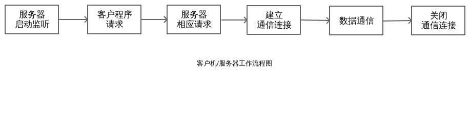

# Linux下网络 Socket 编程预备知识

> Linux系统的一大特点是它的网络编程能力十分强大, 学习它, 让我们真正体会网络的魅力!

## 一. 客户机/服务器模型

        网络应用程序一般是以c/s模型的方式工作的,因特网便是c/s模型的一个典型例子,在这种工作方式中,一个服务器通常事先启动,并在一个熟知端口帧听对服务器的请求,如ftp服务器,web服务器等.当客户机应用程序需要某种服务时,需向提供这个服务的服务器发出请求,服务器收到请求后,向客户机发出相应请求服务.这样客户机应用程序和服务器程序之间就建立了通信连接,此后便可以进行数据通信,通信任务完成后,需要关闭它们之间的通信连接.

## 二. Socket套接字概念

socket这个词可以表示很多概念：

+ 在TCP/IP协议中，“IP地址+TCP或UDP端口号”唯一标识网络通讯中的一个进程，“IP地址+端口号”就称为socket。

+ 在TCP协议中，建立连接的两个进程各自有一个socket来标识，那么这两个socket组成的socket pair就唯一标识一个连接。socket本身有“插座”的意思，因此用来描述网络连接的一对一关系。

+ TCP/IP协议最早在BSD UNIX上实现，为TCP/IP协议设计的应用层编程接口称为socket API

# 预备编程知识

1. 网络字节顺序

